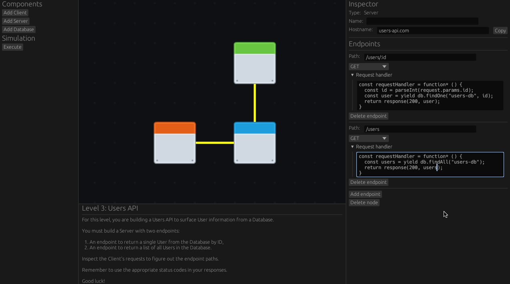

# system-designer-rs

`system-designer-rs` is a puzzle game that combines system design and programming, built in Rust and the [Bevy](https://bevyengine.org/) game engine.

<p align="center">
  
</p>

[See level playthrough video](https://youtu.be/1Rc2Toke0O8).

## Run the game

Install [Rust](https://www.rust-lang.org/tools/install), then execute from your terminal:

```bash
cargo run
```

## Game Modes

- Levels: Compose and implement a system that meets the level requirements in order to pass.
- Sandbox: Experiement with building your own systems, with all available System Components.

## System Components

### Client

All System simulations start at the Clients in the System. Clients each have a list of HTTP requests that they send to dedicated Servers sequentially - a Client's next request is sent when it receives a response for the previous request. When all requests for all Clients have completed, the simulation finishes.

Clients may only be connected to Servers.

#### Client Configuration:

- `Name`: An optional human readable name for this Client.
- `Requests`: A list of Requests that this Client will send sequentially during system simulation - see below.

#### Request Configuration:

Each Request is configured as follows:

- `URL`: This must match a Hostname of a connected Server. The request will be sent to that Server, if it is connected.
- `Path`: The path of the request. If the Server has an endpoint handler whose path pattern matches this path (in addition to the request HTTP method), that endpoint handler will handle the request.
- `Method`: The HTTP method of the request. If the Server has an endpoint handler whose method matches (in addition to the request path), that endpoint handler will handle the request.
- `Body`: The JSON payload for the request.

Requests are not configurable by the player for Levels mode, but they are for the Sandbox mode.

### Server

Servers may be connected to Clients, other Servers, and Databases. Servers handle requests from Clients and other Servers, and may perform operations on Databases.

#### Server Configuration:

Servers are configured as follows:

- `Name`: An optional human readable name for this Server.
- `Hostname`: The hostname of this Server.
- `Endpoints`:
  - `Path`: The path for the endpoint. This supports path patterns, so the for the endpoint path `/users/:id` and incoming request path `/users/1`, the string value `"1"` will be bound and accessible via `request.params.id` within the request handler.
  - `Method`: The HTTP method that this handler expects.
  - `Request` handler: Code that executes when the endpoint receives a request. See below for details.

## Server Endpoint Handler API

Endpoint handlers must be implemented in JavaScript code. Generator functions are used to model "asynchronous" method calls (i.e. any method call that interacts with another Server/Database component), so they must be used with the `yield` keyword. Such methods are denoted with `function*` below.

The default function signature for an endpoint handler must be preserved, and you must return a `Response` object using the `reponse` builder function. Implement your logic for the endpoint within this function:

```javascript
const requestHandler = function* () {
  // Implement me!
  return response(200, "Ok");
};
```

The following objects and functions are globally accessible within an endpoint handler function.

### Types

```typescript
type Value = null | boolean | number | string | Value[] | Map<string, Value>;

type Request = {
  url: string;
  path: string;
  method: string;
  params: Map<string, Value>;
};

type Response = {
  status: number;
  data: Value;
};

type Document = Map<string, JSON>;
```

Note that the value `undefined` is not supported as a value to pass between system components, but it is safe to use within a request handler function itself.

### `request`

The `Request` object that triggered execution of the endpoint handler.

#### Example Usage:

```javascript
const id = parseInt(request.params.id);
```

### `db`

A class instance that implements the following methods to interact with connected Databases.

#### Methods:

- `function* save(dbName: string, doc: Document): Document`
- `function* findOne(dbName: string, id: number): Document | null`
- `function* findAll(dbName: string): Document[]`
- `function* contains(dbName: string, id: number): boolean`
- `function* delete(dbName: string, id: number): void`

#### Example Usage:

```javascript
// Insert a new document:
const savedDoc = yield db.save("db1", { foo: "bar" });

// Specify the id to overwrite an existing document:
const overwrittenDoc = yield db.save("db1", { id: 0, qux: {} });

// Find a document by id:
const doc = yield db.findOne("db1", 5);
```

### `http`

A class instance that implements the following methods to send requests to other connected Servers.

- `function* get(url: string, path: string): Response`

#### Example Usage:

```javascript
const res = yield http.get("server-1.com", "/users/1");
```

### `response`

A function to construct a response from the endpoint handler.

#### Methods:

- `function* response(status: number, body: Value): Response`

#### Example Usage:

```javascript
return response(200, "Ok");
```

### Database

A NoSQL/document database that stores a single collection of JSON objects. All documents stored in a Database have a `id: number` field, but this field is not required when saving a new document. If it is present, it must be of type `number`.

#### Database Configuration:

Databases are configured as follows:

- `Name`: An optional human readable name for this Database.
- `Hostname`: The hostname of this Database.

The Documents stored in the Database during a system simulation will be visible in the Inspector sidebar when the Database is selected.

## Controls

- Add a new component to your system from the LHS sidebar.
- Left click a component in your system to bring up the RHS Inspector sidebar to configure the component, or view its state during a system simulation.
- Left click drag a component to move it around.
- Right click drag a component and release over a different component to form a connection.
- Right click a connection to remove it.
- Start the system simulation by pressing "Execute" on the LHS sidebar. Select a Client to view the responses it receives during the simulation.
